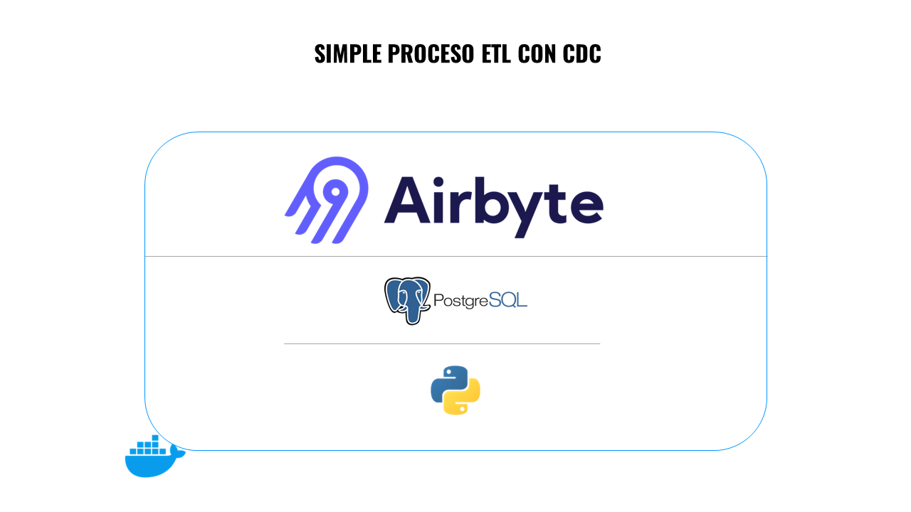

# Airbyte CDC Project

Este proyecto contiene una configuración de Airbyte para la replicación de datos (Change Data Capture - CDC) usando PostgreSQL. El proyecto incluye scripts para inicializar PostgreSQL, sincronizar datos con Airbyte y realizar pruebas de conexión.

## Estructura del Proyecto

```plaintext
airbyte_cdc_project/
│
├── airbyte/                      # Directorio clonado del repositorio de Airbyte
│   ├── ...                       # Archivos y directorios de Airbyte
│
├── src/
│   ├── config/
│   │   ├── __init__.py
│   │   └── settings.py
│   │
│   ├── db/
│   │   ├── __init__.py
│   │   ├── base_repository.py
│   │   ├── connection.py
│   │   └── employee_repository.py
│   │
│   ├── main/
│   │   ├── __init__.py
│   │   └── main.py
│   │
│   ├── models/
│   │   ├── __init__.py
│   │
│   ├── scripts/
│   │   ├── __init__.py
│   │   ├── connection_test.py
│   │   ├── initialize_postgres.py
│   │   └── sync_airbyte.py
│   │
│   ├── services/
│   │   ├── __init__.py
│   │   ├── employee_service.py
│   │
├── tests/
│   ├── test_db
│   │   └── test_employee_repository.py
│   │
│   ├── test_services
│   │   └── test_employee_service.py
│
├── .env                         
├── .gitignore               
├── docker-compose.yml          
├── initialize_log.txt            
├── README.md                   
└── requirements.txt          
```

## Prerrequisitos
- Windows con WSL 2 habilitado
- Docker Desktop instalado y configurado para usar WSL 2
- Git Bash instalado para ejecutar comandos de Git y scripts de shell
- Python 3.8+ y pip para gestionar las dependencias de Python

## Configuración del Entorno
### 1. Instalar WSL 2 y Docker Desktop 
   - Instalar WSL 2:
   Abre PowerShell como administrador y ejecuta los siguientes comandos:

```sh
wsl --install
wsl --set-default-version 2
```
### 2. Instalar la Actualización del Kernel de Linux:
    Descarga e instala el paquete de actualización del kernel de Linux.

### 3. Instalar Docker Desktop:

  Descarga Docker Desktop e instálalo.
       Durante la instalación, asegúrate de seleccionar las opciones:

         - Enable Hyper-V Windows Features 
         - Install required Windows components for WSL 2
         - Reinicia tu computadora cuando se te indique.

### 4. Configurar Docker Desktop para WSL 2:

  Abre Docker Desktop y ve a Settings > Resources > WSL Integration.
  Asegúrate de que la integración con WSL 2 esté habilitada y selecciona tu distribución de Linux.

### 5.  Clonar el Repositorio de Airbyte

  - Abre Git Bash y navega al directorio donde deseas clonar el repositorio:

```
cd /c/Users/tu_usuario/Documents
```

  - Clona el repositorio de Airbyte:

```
git clone --depth=1 https://github.com/airbytehq/airbyte.git

```

### 6. Iniciar Airbyte

    Dentro del directorio airbyte, ejecuta el script para iniciar Airbyte:

```
./run-ab-platform.sh
```
    Abre tu navegador web y navega a http://localhost:8000.

- Usa las credenciales por defecto:
```
Username: airbyte
Password: password
````
- Cambia estas credenciales una vez que Airbyte esté desplegado en un entorno de producción.

### 6. Configurar la Base de Datos PostgreSQL
- Inicia los contenedores definidos en docker-compose.yml:
```
docker-compose up -d
```

- Inicializa la base de datos PostgreSQL utilizando el script initialize_postgres.py:

```
python src.scripts.initialize_postgres
```

- **Scripts Disponibles**
  - **connection_test.py:** Script para probar la conexión a la base de datos.
  - **initialize_postgres.py:** Script para inicializar la base de datos PostgreSQL.
  - **sync_airbyte.py:** Script para sincronizar datos utilizando Airbyte.

### 7. Dependencias
- Instala las dependencias de Python usando pip:

```
pip install -r requirements.txt
```

### 8. Configurar Conexión en Airbyte
- Desde la interfaz de usuario de Airbyte (http://localhost:8000), configura una conexión a tu base de datos PostgreSQL.

### 9. Confirmar la Conexión con PostgreSQL
- Ejecuta el script connection_test.py desde PyCharm o tu terminal para confirmar la conexión con PostgreSQL:
```
python -m src.scripts.connection_test
```

### 10. Obtener el ID de Workspace y Connection UUID
- Ejecuta el script get_workspace_id.py para obtener el ID del Workspace:
```
python -m src.scripts.get_workspace_id
```

- Utiliza el ID del Workspace obtenido para ejecutar el script get_connection_UUID.py y obtener el Connection UUID:
```
python -m src.scripts.get_connection_UUID
```

### 11. Configurar el Connection UUID en employee_service.py
- Abre src/services/employee_service.py y actualiza la variable CONNECTION_ID con el UUID de la conexión obtenida.

### 12. Ejecutar el Script Principal
- Finalmente, ejecuta el script principal para realizar inserciones, modificaciones y eliminaciones en la tabla de empleados, y sincronizar automáticamente con Airbyte:
```
python -m src.main.main
```

## Resumen de Scripts y Archivos Importantes
- src/scritps/initialize_postgres.py: Inicializa la tabla de empleados y configura la replicación.
- src/scritps/connection_test.py: Verifica la conexión con la base de datos PostgreSQL.
- src/scritps/get_workspace_id.py: Obtiene el ID del Workspace de Airbyte.
- src/scritps/get_connection_UUID.py: Obtiene el UUID de la conexión configurada en Airbyte.
- src/services/employee_service.py: Contiene la lógica para las operaciones CRUD y la sincronización con Airbyte.
- src/main/main.py: Script principal que realiza operaciones de inserción, actualización y eliminación en la tabla de empleados, y sincroniza con Airbyte.

## Notas
Asegúrate de tener el servidor de Airbyte y PostgreSQL corriendo antes de ejecutar los scripts.
Configura las variables de entorno necesarias en un archivo .env en la raíz del proyecto, con las credenciales de tu base de datos PostgreSQL y cualquier otra configuración necesaria.
```
DATABASE_HOST=localhost
DATABASE_PORT=5432
DATABASE_USER=airbyte_user
DATABASE_PASSWORD=airbyte_password
DATABASE_DBNAME=airbyte_db
```
